# Helto ComfyUI Utils

Helto ComfyUI Utils is a small ComfyUI custom node pack for everyday workflow glue: video parameter helpers, image and video comparison previews, model routing, multi-image selection, advanced image/video saving, and the `QManager` left-sidebar workflow queue.

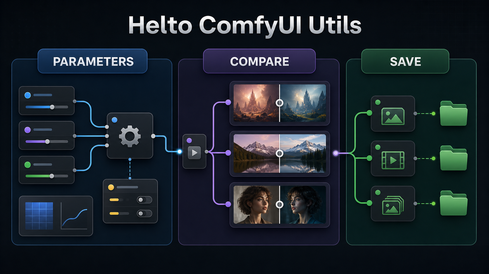

## Installation

Install the pack into ComfyUI's `custom_nodes` directory, then restart ComfyUI.

```bash
cd /path/to/ComfyUI/custom_nodes
git clone git@github.com:helto4real/comfyui-utils.git
```

The pack registers through ComfyUI's V3 `comfy_entrypoint()` extension API and exposes its frontend assets from `./web`. If ComfyUI is already running, restart it after installing or updating the node pack so the Python nodes and JavaScript widgets are reloaded.

`Save Video Advanced` needs `ffmpeg` for video container outputs. It first tries `imageio-ffmpeg`, then falls back to `ffmpeg` on `PATH`.

## Node Catalog

| Node | ID | Category | What it is for |
| --- | --- | --- | --- |
| Video Parameters | `HeltoVideoParams` | `HELTO/Video` | WAN 2.2 width, height, frame count, and sampler parameter helper. |
| Video Parameters LTX | `HeltoVideoParamsLTX` | `HELTO/Video` | LTX 2.3 width, height, frame-safe frame count, and sampler parameter helper. |
| Aspect Ratio Calculator | `AspectRatioCalculator` | `HELTO/Utils` | Converts a side length plus aspect ratio into width and height. |
| Model Auto Router (Mute-safe) | `ModelAutoRouter` | `HELTO/Utils` | Routes `model_a` when connected, otherwise falls back to `model_b`. |
| Prompt enhancer | `HeltoPromptEnhancer` | `HELTO/Prompt` | Enhances image prompts and scripted video segments through a configured prompt provider. |
| Privacy Show Any | `HeltoPrivacyShowAny` | `HELTO/Privacy` | Displays any connected value as copyable text while saving only encrypted display state. |
| Image Comparer | `HeltoImageComparer` | `HELTO/Image` | Output node that previews an original image against a new image. |
| Video Comparer | `HeltoVideoComparer` | `HELTO/Video` | Output node that previews two videos or frame batches side by side. |
| Load Video | `HeltoLoadVideo` | `HELTO/Video` | Loads videos from a searchable picker as frames, audio, and metadata. |
| Helto Multi-Image Selector | `HeltoImageSelector` | `image` | Selects multiple local images from a searchable browser and outputs image, mask, and bbox data. |
| Save Image Advanced | `HeltoSaveImageAdvanced` | `HELTO/Image` | Saves PNG images to an absolute folder with alternate/date/subfolder routing. |
| Save Video Advanced | `HeltoSaveVideoAdvanced` | `HELTO/Video` | Saves frame batches or latents as GIF, WebP, or video with folder routing and format controls. |

## QManager

`QManager` is a left-sidebar queue manager for queued workflow runs. New queued workflows are added to the Running tab, move to History when they finish, and then automatically allow the next pending workflow to start.

Queue state is persisted in `config/queue_manager_state.sqlite3`. Privacy mode is enabled by default and encrypts the stored SQLite payload at rest, including queue and history metadata. When ComfyUI restarts, the queue stays paused and does not auto-resume; use the resume control when you are ready to continue.

Rows stay compact and show the workflow title, status, time, and icon actions on one line. Current and history runs can load their saved workflow. Active runs can be aborted from the queue row and move to History with the `Aborted` status. If ComfyUI stops tracking an active run after a crash, QManager moves that stale run to History as an error and continues with the next pending run when the queue is not paused. History runs can also be rerun, deleted individually, or cleared all at once. The History tab includes a same-row search box and workflow-name dropdown for filtering completed runs.

The latest output preview button supports image and video outputs. Hovering the icon shows a small thumbnail, and clicking opens the shared media preview window. Preview URLs support both regular ComfyUI `/view` image/video records and encrypted private-media records produced by this node pack's privacy-aware save and preview nodes.

## Parameter Helpers

### Video Parameters

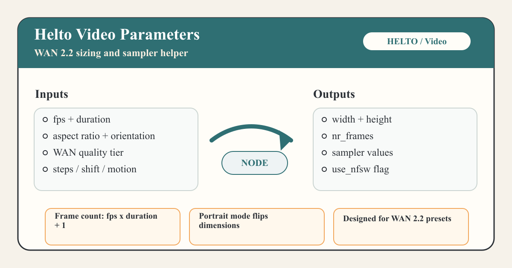

`Video Parameters` returns WAN 2.2-oriented dimensions and sampler values that can be wired into video workflows.

Inputs:

| Input | Type | Default | Notes |
| --- | --- | --- | --- |
| `fps` | Float | `24.0` | Frames per second. |
| `duration` | Int | `5` | Duration in seconds. |
| `aspect_ratio` | Combo | first option | One of `16:9`, `4:3`, `3:2`, `1:1`. |
| `orientation` | Combo | `landscape` | `landscape` or `portrait`; ignored for square output. |
| `quality_tier` | Combo | `6 - WAN 2.2 native` | Selects one of the built-in WAN resolution tiers. |
| `use_nfsw` | Boolean | `False` | Passed through as a boolean output with the same name. |
| `motion_amplitude` | Float | `1.15` | Passed through for downstream sampler controls. |
| `steps` | Int | `6` | Passed through for downstream sampler controls. |
| `shift_value` | Float | `8.0` | Passed through for downstream sampler controls. |

Outputs: `fps`, `duration`, `width`, `height`, `nr_frames`, `steps`, `shift_value`, `motion_amplitude`, `use_nfsw`.

Frame count is calculated as `int((fps * duration) + 1)`. Dimensions come from the selected WAN tier and are flipped for portrait orientation.

### Video Parameters LTX

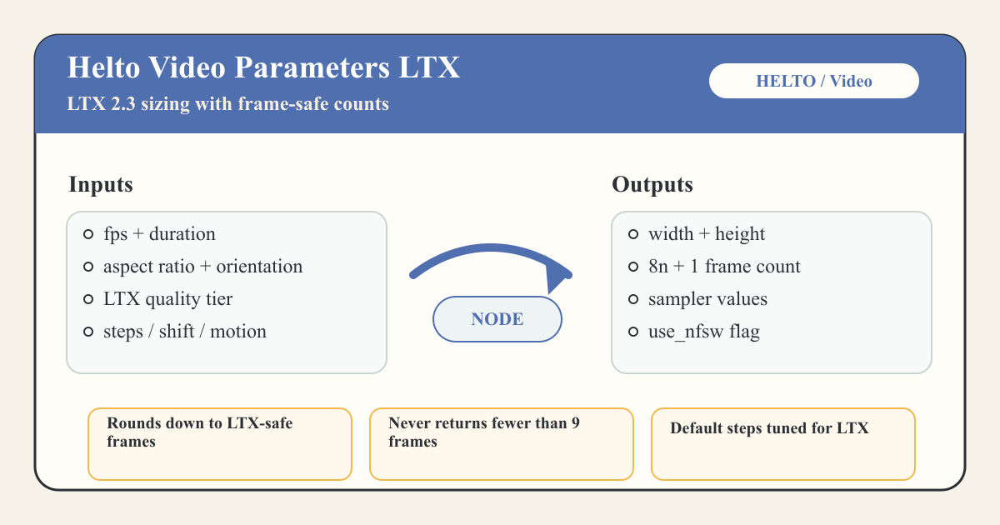

`Video Parameters LTX` is the LTX 2.3 version of the same helper.

It uses the same input and output shape as `Video Parameters`, but its default quality tier is `6 - LTX 2.3 native`, its default `steps` value is `8`, and its frame count is adjusted to LTX-safe counts. The node calculates a target from `fps * duration`, rounds down to an `8n + 1` frame count, and never returns fewer than `9` frames.

### Aspect Ratio Calculator

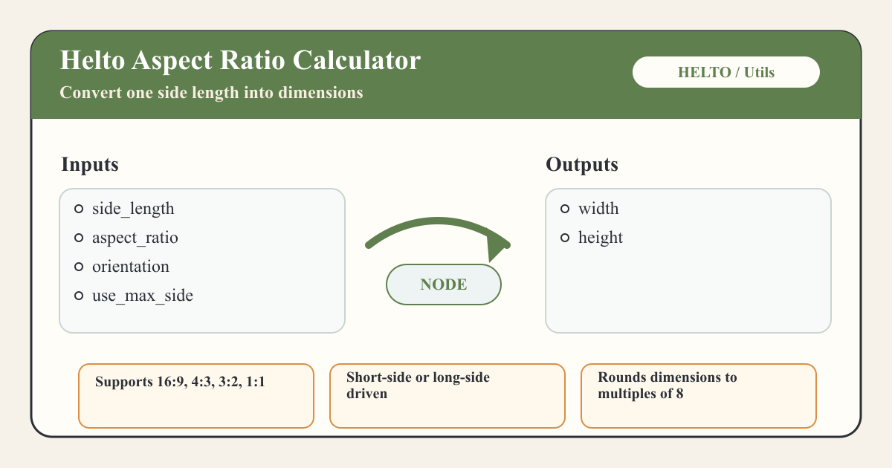

`Aspect Ratio Calculator` turns a side length into width and height values.

Inputs:

| Input | Type | Default | Notes |
| --- | --- | --- | --- |
| `side_length` | Int | `512` | Side length from `64` to `8192`, stepped by `8`. |
| `aspect_ratio` | Combo | first option | One of `16:9`, `4:3`, `3:2`, `1:1`. |
| `orientation` | Combo | first option | `landscape` or `portrait`. |
| `use_max_side` | Boolean | `False` | When false, `side_length` is the short side. When true, it is the long side. |

Outputs: `width`, `height`.

Both dimensions are rounded down to multiples of 8 before output.

## Routing

### Model Auto Router (Mute-safe)

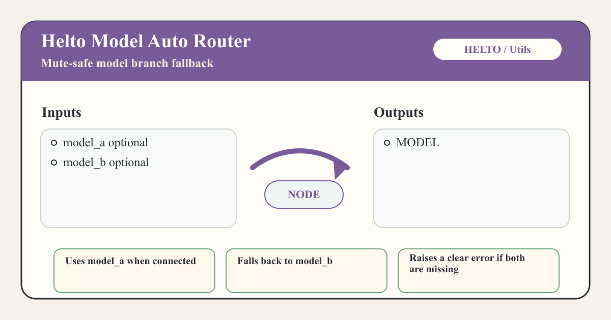

`Model Auto Router (Mute-safe)` is useful when a workflow may have alternate model branches.

Inputs:

| Input | Type | Required | Notes |
| --- | --- | --- | --- |
| `model_a` | Model | No | Preferred model input. |
| `model_b` | Model | No | Fallback model input. |

Output: one `MODEL`.

If `model_a` is connected, it is returned. If `model_a` is missing and `model_b` is connected, `model_b` is returned. If neither input is available, the node raises an error telling you to connect or unmute at least one model.

## Prompting

### Prompt Enhancer

`Prompt enhancer` can enhance a plain image prompt or a structured video script. The `script` field is privacy-aware: with `privacy_mode` enabled, saved workflow text is encrypted, and `hide_mode` hides the inline editor until hovered. Use the `edit script` button when you want a larger editor.

Inputs:

| Input | Type | Default | Notes |
| --- | --- | --- | --- |
| `images` | Image | optional | Optional reference images. Video scripts can address them as `@image1`, `@image2`, and so on. |
| `video` | Video | optional | Marks video context as available for the system prompt; video bytes are not sent to the provider. |
| `audio` | Audio | optional | Marks audio context as available for the system prompt; audio bytes are not sent to the provider. |
| `seed` | Int | `-1` | `-1` generates a new seed per node execution. Fixed seeds are reused across all generated segments. |
| `prompt_type` | Combo | `image` | Use `image`, `video`, or `multi scene video`. |
| `active_segment_index` | Int | `1` | One-based selected segment for `single segment` mode. |
| `segment_generation_mode` | Combo | `all segments` | `all segments` generates every parsed video segment. `single segment` generates only `active_segment_index`. Ignored in image mode. |
| `vision_context_mode` | Combo | `auto` | `auto` sends images directly to image-capable writer models, otherwise uses the configured separate vision model. Use `off` for text-only runs. |
| `script` | String | empty | Plain image prompt, or video script when `prompt_type` is `video` or `multi scene video`. |
| `variables` | String | `[]` | Serialized variables used by `{{variable_name}}` tokens. |
| `hide_mode` / `privacy_mode` | Boolean | `False` / `True` | Hide the editor content on the canvas, and encrypt serialized script text. |

Outputs include the final `enhanced_prompt`, the rendered `system_prompt`, parsed segment diagnostics, generated `visual_context`, `segment_count`, and parser `warnings`.

Image handling supports both multimodal writer models and text-only writer models. In `direct to writer` mode, selected images are sent to the main writer model. In `separate vision model` mode, the selected images are first analyzed by `vision_provider` / `vision_model_id`, then the resulting visual notes are sent as text to the writer model. `auto` chooses direct mode for known image-capable writer models such as Llava-style Ollama models, otherwise it uses the configured separate vision model when images are selected.

#### Video Script Syntax

In `video` and `multi scene video` modes, plain text without separators is treated as one segment. Split multiple segments with `---` on its own line:

```text
[rating=SFW]
[style=cinematic realism]
[camera=slow handheld push-in]

## A traveler enters a rainy neon alley. @image1:start
>> Ends with the traveler looking toward a glowing doorway.

---

[reference_mode=end_guidance]
[duration=5 seconds]
The traveler walks toward the doorway as steam rolls across the street. @image2:end
```

Supported syntax:

| Syntax | Meaning |
| --- | --- |
| `---` | Starts a new segment when placed on its own line. |
| `[key=value]` | Metadata. Global metadata must appear at the top before segment text. Segment metadata appears inside a segment. |
| `>> text` or `> > text` | Continuity note for the current segment. |
| `@imageN[:role][:describe]` | Reference image marker, where `N` is one-based. If no role is given, `start` is used. In video modes, these markers select which connected images are used for that segment's direct or separate vision pass. Add `:describe` when the model should describe the reference for that role before applying the requested action. |
| `## text` | Visual heading markup is stripped, leaving `text` as direction. |
| `{{name}}` | Variable token replaced from the node's variable list before parsing. |

Global metadata keys: `rating`, `style`, `default_reference_mode`, `camera`, `duration`, `continuity_mode`.

Segment metadata keys: `rating`, `reference_mode`, `style`, `camera`, `duration`, `continuity`.

Image roles: `start`, `end`, `character`, `style`, `pose`, `setting`, `motion`.

Image modifier: `describe`. For example, `@image2:character:describe` asks the writer or vision model to describe the referenced character first, including visible traits such as skin tone or complexion, face shape and facial features, hair color and style, facial expression, apparent age range, build, clothing, posture, gaze, markings, and distinctive features, then use those traits in the requested action. If a described character reference introduces a new subject in a later segment, the model should visually introduce that subject before the action. For animals, `:describe` asks for coat or fur color, markings, size, breed-like features, ears, tail, face or muzzle, body shape, expression, posture, stance, gait, and motion-relevant traits. Ethnicity is not inferred from images; if you explicitly provide ethnicity or identity descriptors in your prompt, they are respected. `@image1:describe` means `@image1:start:describe`, so the visible opening frame is described before motion begins. If your prompt explicitly changes, replaces, ignores, or reinterprets image details, your prompt wins; otherwise the referenced image is the source of truth for that description.

You can reference the same image with multiple roles when you need both scene and character detail. For example, `@image1:start:describe @image1:character:describe` uses image 1 as the full opening frame/environment and also asks the model to describe each central person separately before the action.

Reference modes: `none`, `start_frame`, `end_guidance`, `start_and_end_transition`, `character_reference`, `style_reference`, `mixed`.

If `reference_mode` is not set on a segment, it is inferred from image roles: only `start` becomes `start_frame`, only `end` becomes `end_guidance`, `start` plus `end` becomes `start_and_end_transition`, only `character` becomes `character_reference`, only `style` becomes `style_reference`, and mixed role sets become `mixed`. `default_reference_mode` is used only when a segment has no image references.

`all segments` mode calls the provider once per parsed segment and joins the generated prompts with one empty line. `single segment` mode validates and uses only `active_segment_index`. Image mode does not parse this syntax; the full `script` text is sent as the image prompt.

Example with a text-only writer model: set the main provider/model to your text model, keep `vision_context_mode=auto`, and set the vision model selector to a VLM such as `qwen3_vl_4b_fast`. A segment containing `@image1:character` sends image 1 to the vision model, inserts its visual notes into `visual_context`, then asks the text-only writer to produce the final prompt.

Dog reference example:

```text
[rating=SFW]
[style=cinematic realism, natural motion]

A woman walks along a quiet forest path. @image1:start

---

A dog runs beside the woman. @image2:character:describe
```

Couple-on-beach example:

```text
[rating=SFW]
The man and the woman turn toward each other and look deeply into each other's eyes. @image1:start:describe @image1:character:describe
```

Here `start:describe` asks for the beach, ocean, sky, lighting, composition, and opening frame, while `character:describe` asks for the man and woman to be described separately with stable labels and visible traits.

## Compare Previews

### Image Comparer

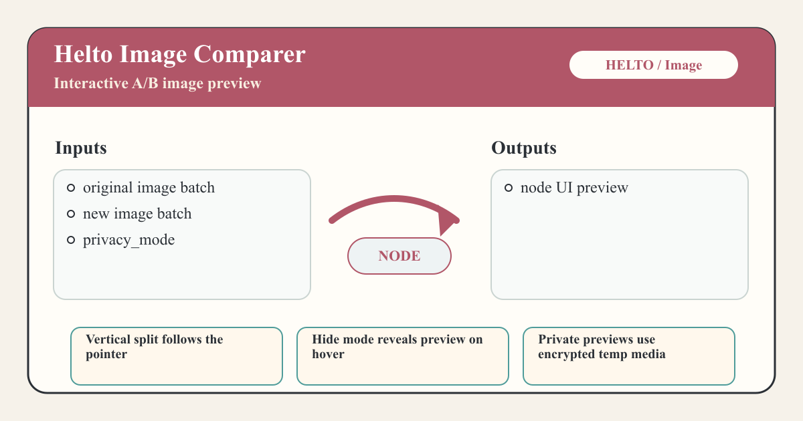

`Image Comparer` is an output node for visual A/B checks inside the graph.

Inputs:

| Input | Type | Default | Notes |
| --- | --- | --- | --- |
| `original` | Image | optional | Baseline image batch. Works as before when no mask is connected. |
| `new` | Image | optional | Candidate image batch. Works as before when no mask is connected. |
| `original_mask` | Mask | optional | When connected with `original`, masked areas are previewed as black. When connected without `original`, the mask is previewed directly. |
| `new_mask` | Mask | optional | When connected with `new`, masked areas are previewed as black. When connected without `new`, the mask is previewed directly. |
| `privacy_mode` | Boolean | `True` | When true, preview images are written through the encrypted private-media path. |

Outputs: none. The node saves preview images and returns UI data for the frontend widget.

The frontend extension adds a `hide mode` toggle. With hide mode enabled, the node shows a placeholder until the pointer is over the preview area. When both images are available, the preview uses a vertical split that follows the pointer so you can compare the original and new image in place.

### Video Comparer

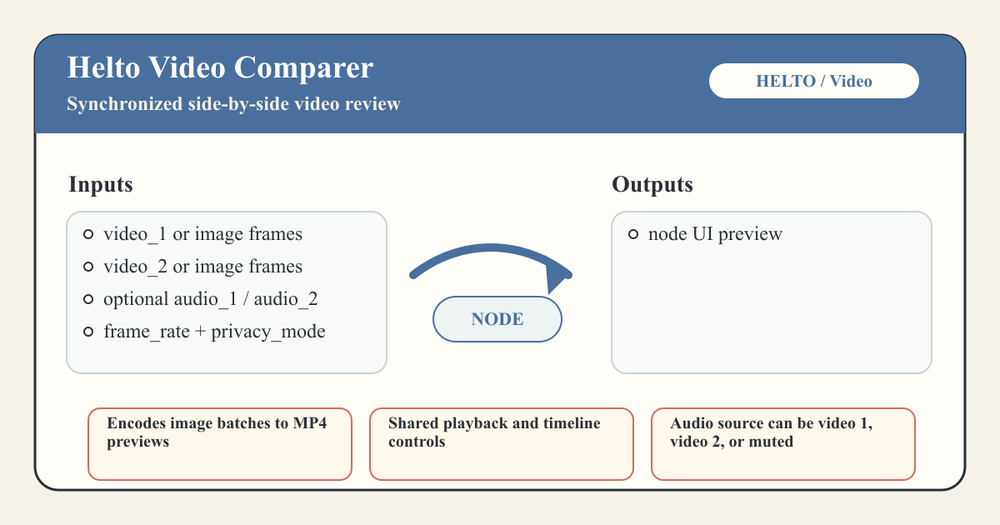

`Video Comparer` is an output node for synchronized side-by-side video review.

Inputs:

| Input | Type | Default | Notes |
| --- | --- | --- | --- |
| `video_1` | Video or Image | required | A ComfyUI video object or an image frame batch. |
| `video_2` | Video or Image | required | A ComfyUI video object or an image frame batch. |
| `audio_1` | Audio | optional | Audio source for the first preview. |
| `audio_2` | Audio | optional | Audio source for the second preview. |
| `frame_rate` | Float | `24.0` | Used when image batches are encoded into preview videos. |
| `privacy_mode` | Boolean | `True` | When true, preview MP4 data is written through the encrypted private-media path. |

Outputs: none. The node writes MP4 previews and returns UI data for the frontend widget.

The frontend widget provides synchronized playback, a timeline, time display, hide mode, and an `audio source` selector with `video 1`, `video 2`, and `muted`. Image batches are converted to H.264 MP4 previews; odd image dimensions are padded for encoder compatibility.

## Loading

### Load Video

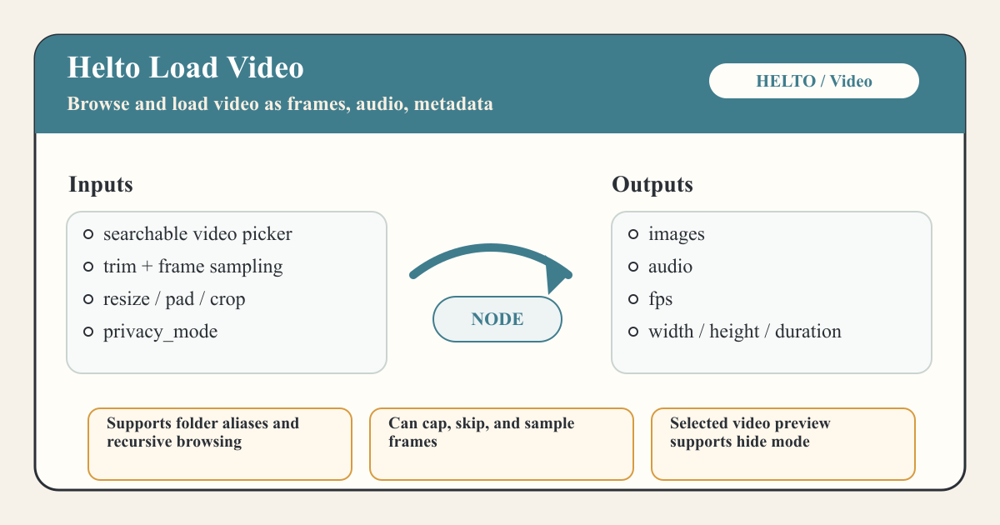

`Load Video` loads a selected video into a ComfyUI image-frame batch and passes through audio plus source metadata.

Inputs are widgets only; the node has no incoming sockets. The video picker opens from the `choose video` button and can browse the default ComfyUI input folder plus configured folder aliases. The picker includes recursive browsing, search by relative filename/path, sort controls, refresh, column sizing, and muted hover previews.

Inputs:

| Input | Type | Default | Notes |
| --- | --- | --- | --- |
| `video` | String | empty | Relative path selected from the video picker. |
| `video_folder_alias` | String | `input` | Hidden alias for the selected configured folder. |
| `start_time` | Float | `0.0` | Start offset in seconds. |
| `duration` | Float | `0.0` | Seconds to load; `0` loads to the end. |
| `force_rate` | Float | `0.0` | Output frame rate override; `0` keeps the source-derived rate. |
| `frame_load_cap` | Int | `0` | Maximum output frames; `0` means uncapped. |
| `skip_first_frames` | Int | `0` | Frames to skip after the start offset. |
| `select_every_nth` | Int | `1` | Keeps every nth frame. |
| `resize_mode` | Combo | `original` | `original`, `resize`, `pad`, or `crop`. |
| `custom_width` / `custom_height` | Int | `0` | Target size for resize/pad/crop; `0` uses the source dimension. |
| `privacy_mode` | Boolean | `True` | When true, the selected video preview is served through the private-media path. |

Outputs: `images`, `audio`, `fps`, `width`, `height`, `duration`.

Supported picker extensions are `mp4`, `mov`, `mkv`, `webm`, `avi`, and `m4v`. The node is marked as having intermediate output so its selected-video UI can persist when it sits on the path to another output node. The frontend adds a `hide mode` toggle for the node preview; when enabled, the selected video preview is hidden until hovered.

### Helto Multi-Image Selector

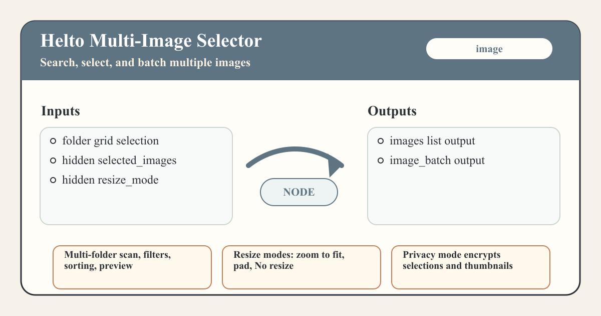

`Helto Multi-Image Selector` is a searchable image browser for selecting multiple local images directly in a ComfyUI node.

The frontend widget can scan one or more folders, enable recursive browsing, filter by root folder or subfolder, sort by date or name, search by filename/path, preview selected images in the shared media preview window, edit masks and bounding boxes, clear the selection, and delete selected images from disk when they are inside the configured scan scope. The selected-image list and annotations are stored in hidden widgets so the workflow can run without visible input sockets.

Inputs:

| Input | Type | Default | Notes |
| --- | --- | --- | --- |
| `selected_images` | String | `[]` | Hidden serialized selection. In privacy mode this is encrypted before prompt serialization. |
| `resize_mode` | String | `zoom to fit` | Hidden output sizing mode: `zoom to fit`, `pad`, or `No resize`. |
| `edited_masks` | String | `{}` | Hidden serialized edited-mask references. In privacy mode this is encrypted before prompt serialization. |
| `edited_bboxes` | String | `{}` | Hidden serialized original-pixel bounding boxes. In privacy mode this is encrypted before prompt serialization. |
| `batching_mode` | Boolean | `false` | Hidden batching switch. Disabled emits one full-batch item through the list outputs; enabled emits one item per selected image. |

Outputs: `images` as an image list, `image_batch` as a batched image tensor, `masks` as a mask list, `mask_batch` as a batched mask tensor, and `bboxes` as SAM3-compatible `BOUNDING_BOX` data. With `batching_mode` disabled, `images`, `masks`, and `bboxes` each emit one list item containing the full selection, matching the aggregate batch behavior. With `batching_mode` enabled, those list outputs emit one item per selected image so downstream nodes run once per image while `image_batch` and `mask_batch` still provide the full aggregate tensors. The `bboxes` data stays aligned to the selected image order.

When no valid image is selected, the node returns a 512x512 black placeholder. `zoom to fit` resizes selected images to the first image's dimensions, `pad` pads images to the largest selected dimensions, and `No resize` preserves each loaded image before the batch output normalizes mixed sizes. Privacy mode also encrypts thumbnail cache entries and serialized selections.

### Privacy Show Any

`Helto Privacy Show Any` is an output node for inspecting arbitrary values. It accepts an `*` input, converts safe values to text, displays the result in a read-only node panel, exposes a copy button, and outputs the same text as a string.

Plain display text is not serialized into the workflow. The frontend stores the last displayed value only in the hidden `encrypted_text_state` widget using the same `__HELTO_ENC__:` encryption route as the multi-image selector.

Scalar values, strings, bytes that decode as UTF-8, lists, tuples, sets, and dictionaries convert directly to text or JSON. Tensor-like and array-like values are summarized by shape, dtype, and device unless they are tiny. Runtime-heavy objects such as models, CLIP, VAE, samplers, and other opaque Python instances are reported as unsupported because their internal state is not meaningful or safe to stringify.

## Advanced Saving

### Save Image Advanced

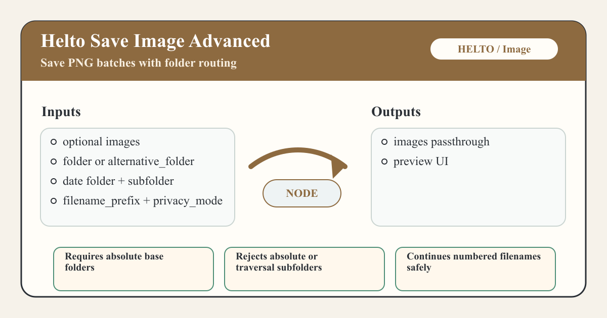

`Save Image Advanced` saves PNG images to a chosen absolute folder while passing the image batch through.

Inputs:

| Input | Type | Default | Notes |
| --- | --- | --- | --- |
| `images` | Image | optional | If missing, the node reuses its cached preview UI. |
| `folder` | String | ComfyUI output directory | Primary absolute output folder. |
| `alternative_folder` | String | empty | Alternate absolute output folder. |
| `use_alternative_folder` | Boolean | `False` | Selects `alternative_folder` instead of `folder`. |
| `use_date_folder` | Boolean | `False` | Appends a `YYYY-MM-DD` folder. |
| `subfolder` | String | empty | Relative subfolder appended after the optional date folder. |
| `filename_prefix` | String | `img` | Prefix for numbered files. |
| `privacy_mode` | Boolean | `True` | When true, preview images are written through the encrypted private-media path. |

Output: `images`.

Files are saved as `filename_prefix_00001.png`, `filename_prefix_00002.png`, and so on. The counter continues from matching files already in the destination folder. The node requires an absolute base folder, rejects absolute subfolders, rejects subfolder path traversal, and stores workflow metadata in PNG output when ComfyUI metadata is enabled.

The frontend extension adds hide-mode behavior for image previews.

### Save Video Advanced

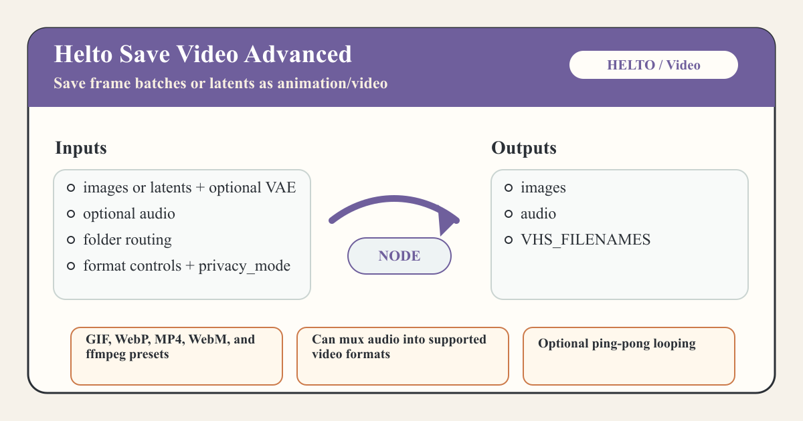

`Save Video Advanced` saves frame batches or latents as animated images or videos while passing through decoded images and audio.

Inputs:

| Input | Type | Default | Notes |
| --- | --- | --- | --- |
| `images` | Image or Latent | optional | Connect a VAE when passing latents. |
| `audio` | Audio | optional | Muxed into supported video outputs. |
| `vae` | VAE | optional | Required only when `images` receives latents. |
| `frame_rate` | Float | `24.0` | Output frame rate. |
| `loop_count` | Int | `0` | Loop count for animated image and ffmpeg loop handling. |
| `folder` | String | ComfyUI output directory | Primary absolute output folder. |
| `alternative_folder` | String | empty | Alternate absolute output folder. |
| `use_alternative_folder` | Boolean | `False` | Selects `alternative_folder` instead of `folder`. |
| `use_date_folder` | Boolean | `False` | Appends a `YYYY-MM-DD` folder. |
| `subfolder` | String | empty | Relative subfolder appended after the optional date folder. |
| `filename_prefix` | String | `video` | Prefix for numbered files. |
| `format` | Combo | `video/h264-mp4` when available | Includes `image/gif`, `image/webp`, and discovered/fallback video presets. |
| `pingpong` | Boolean | `False` | Appends reversed middle frames for a ping-pong loop. |
| `save_output` | Boolean | `True` | When false, writes to ComfyUI temp instead of the selected output folder. |
| `privacy_mode` | Boolean | `True` | When true, previews are served through the encrypted private-media path, including preview-only runs with `save_output=False`. |

Outputs: `images`, `audio`, and `filenames` as `VHS_FILENAMES`.

The `filenames` output is a tuple of `(save_output, output_files)`, matching VideoHelperSuite-style filename consumers. Video outputs return one final path; when audio is muxed, it replaces the silent intermediate at the normal numbered filename.

Formats come from VideoHelperSuite-compatible JSON presets when they are available, with built-in fallbacks for `video/h264-mp4`, `video/webm`, and `video/ffmpeg-gif`. The frontend extension shows extra format-specific widgets after the `format` selector.

## Troubleshooting

| Problem | What to check |
| --- | --- |
| `Save Image Advanced requires an absolute base folder path.` | Use an absolute path in `folder` or `alternative_folder`, such as `/home/me/ComfyUI/output`. |
| `subfolder must be relative` or `subfolder cannot contain path traversal` | Keep `subfolder` relative and do not use `..`. |
| `ffmpeg is required for Save Video Advanced video outputs.` | Install `imageio-ffmpeg` in the ComfyUI environment or make `ffmpeg` available on `PATH`. |
| Latent input fails in `Save Video Advanced` | Connect a VAE when the `images` input receives latents. |
| `Save Video Advanced private preview is not available downstream` | With `save_output=False` and `privacy_mode=True`, the encrypted UI preview is available, but `filenames` is intentionally empty because no readable video file is saved. |
| `Ingen modell hittades!` from `Model Auto Router` | Connect or unmute at least one of `model_a` or `model_b`. |
| Expected video format is missing | Install or check VideoHelperSuite-compatible `video_formats` JSON presets. Built-in fallback formats are still available. |
| Comparer or selector preview is hidden | Toggle `hide mode` off, or hover the node preview area to reveal it. |
| Multi-image selector returns a black image | Select at least one existing image, or refresh/rescan if a previously selected file moved. |

## Implementation Notes

This README is based on the current node schemas and behavior in this repository:

- Pack registration and web directory: `__init__.py`
- Node implementations: `nodes/**/__init__.py` and `helto_selector_backend/node.py`
- Selector backend routes and services: `helto_selector_backend/routes.py`, `helto_selector_backend/services.py`, and `helto_selector_backend/image_processing.py`
- Queue manager routes, SQLite persistence, and frontend: `shared/queue_manager_routes.py`, `shared/queue_manager_store.py`, and `web/queue_manager.js`
- Shared frontend media preview utility: `web/media_preview.js`
- Shared video dimensions and frame calculations: `shared/video_params.py`
- Frontend selector, preview, load, and save widgets: `web/*.js`

ComfyUI V3 extension loading, schema, node output, list-output, and UI preview behavior were checked against the local ComfyUI source in `/home/thhel/git/ComfyUI/comfy_api/latest/_io.py`, `/home/thhel/git/ComfyUI/comfy_api/latest/_ui.py`, and `/home/thhel/git/ComfyUI/nodes.py`.
